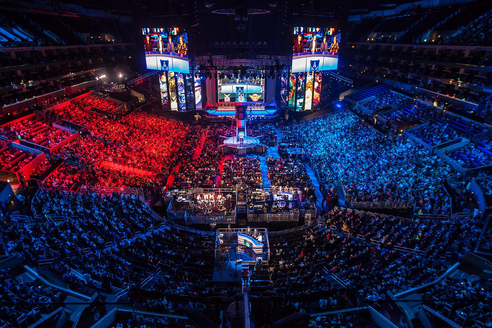
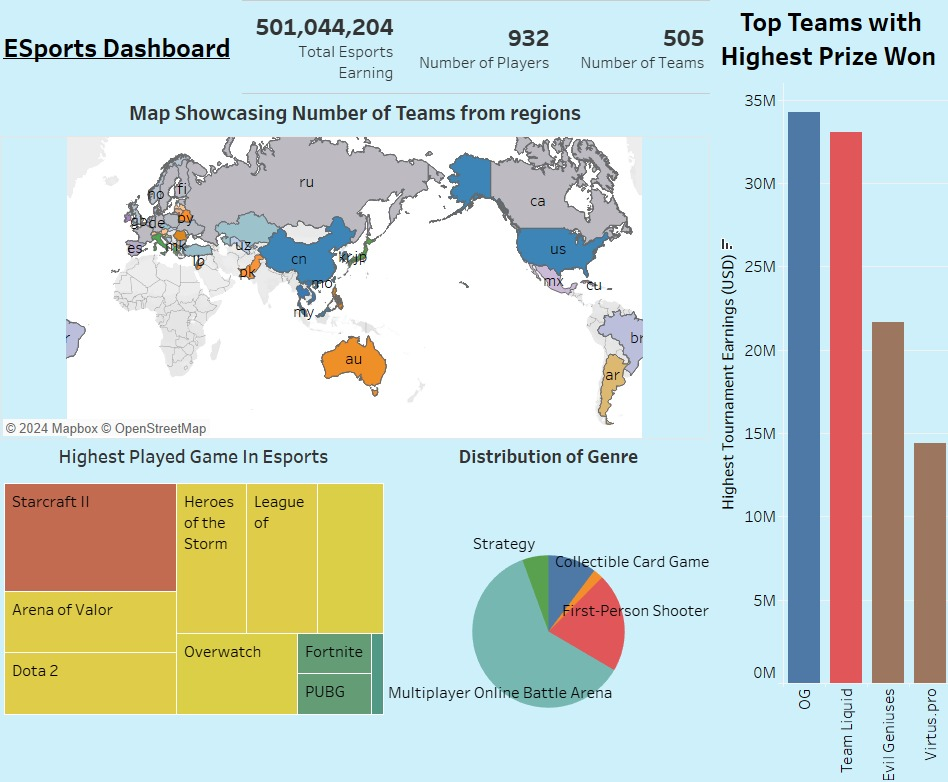
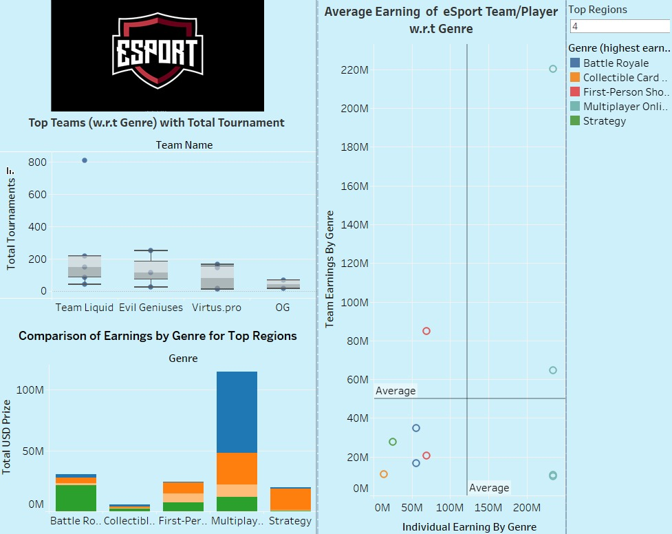

# E-Sports Dynamic Dashboard 🎮📊

## Introduction

In the contemporary landscape of digital entertainment, delving into eSports earnings data offers insights into the profound transformation occurring within competitive gaming. This repository explores the professionalization of gaming, shedding light on factors influencing success in eSports beyond sheer skill.

## Problem Selection 🎯

The significance of rooting into eSports earnings data cannot be overstated. This exploration underscores the professionalization of gaming, illustrating how what was once considered a niche hobby has blossomed into a multi-billion-dollar industry. Beyond personal interest, this topic represents a paradigm shift in entertainment consumption, attracting a global audience and reshaping traditional notions of sports and competition.

## Tableau Concepts Covered 🖥️

In this project, several Tableau concepts were utilized to analyze and visualize the eSports earnings data:

- **Level of Detail (LOD) Expressions**: Used to perform calculations at different levels of granularity, providing deeper insights into the data.
- **Calculated Fields**: Created custom calculations to derive meaningful metrics and indicators.
- **Parameters**: Enabled dynamic interactivity, allowing users to customize their analysis.
- **Filters**: Applied to focus on specific subsets of data for in-depth analysis.
- **Sets**: Utilized for grouping and segmenting data based on specific criteria.
- **Actions**: Implemented to create interactive elements for a seamless user experience.
- **Groups**: Utilized to categorize data points for easier analysis and visualization.

## Data Cleaning 🧹

The datasets utilized in this project include Country and CountryCode, Highest Earning Players, and Highest Earning Teams. Key columns and features such as Player/Team Name, Country, Genre of Gaming, Game, and Prize Money (USD) were explored to understand the eSports ecosystem comprehensively. Data cleaning processes were implemented to ensure accuracy and consistency in the analysis.

## Questions Explored ❓

The dashboards and stories answer the following questions:

- How does earnings distribution vary across different countries and regions in the eSports industry?
- Are certain countries or regions dominating in terms of earnings, and what factors contribute to their success?
- What is the relationship between gaming genres and earnings in eSports?
- How do the earnings of individual players compare to those of teams in eSports?
- Does the size or popularity of a game impact the earnings potential for players and teams in eSports?

## Dashboards Overview 📊

### Dashboard 1: eSports Insights

This dashboard showcases key performance indicators, the highest played game in eSports, distribution of gaming genres, top teams with highest prizes won, and a map illustrating the number of teams participating from each region.

### Dashboard 2: External Factors Analysis

The second dashboard focuses on external factors such as tournaments played, average earnings, top teams, comparison of earnings by genre for top regions, and average earnings of eSports players and teams with respect to genre. It is interactive and offers a comprehensive analysis of the eSports landscape.

## Story: Mapping the eSports Landscape 🗺️

The story maps the eSports landscape while exploring trends such as:

- KPIs in eSports
- Global team participation rates in Russia, Canada, and Australia
- Distribution of eSports genres and their popularity rankings
- China's dominance in eSports genres and earnings
- StarCraft 2 tournament hotspots worldwide

 4.mp4

## Suggestions and Conclusion 🚀

- **Diversify Analysis**: Explore additional dimensions such as sponsorship deals, marketing strategies, and player demographics for a holistic understanding of the eSports ecosystem.
- **Dynamic Visualization**: Incorporate dynamic visualizations and predictive analytics to anticipate future trends and opportunities in the eSports industry.
- **Continuous Monitoring**: Regularly update and monitor the dashboard with new data to stay abreast of evolving trends and developments in the eSports landscape.

In conclusion, the analysis of eSports earnings data offers invaluable insights into the evolving landscape of digital entertainment and its impact on individuals and industries worldwide. By leveraging Tableau's powerful visualization capabilities, this project provides a comprehensive understanding of the intricate ecosystem that underpins eSports, shedding light on the economic forces at play within this dynamic industry.
